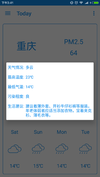

### Today

[Flux介绍](http://kermit95.github.io/2016/03/19/Flux%E6%A8%A1%E5%BC%8F%E5%AE%9E%E8%B7%B5/)

PS:

1. fluxbase包下的类只和EventBus有耦合, 所以是可复用的, 当然你可以根据自己的情况做出改进
2. 这个项目的核心库是EventBus, 除此之外所有的库都是非必需的
3. Dispatcher可以用EventBus/Otto实现, 但如果你使用了RxJava, 可以自己实现RxBus替代
4. 了解更多关于Android架构消息, 请关注[官方信息](https://github.com/googlesamples/android-architecture/issues)

### Thanks for

[lgvalle](https://github.com/lgvalle/android-flux-todo-app)

[ntop](http://www.jianshu.com/p/896ce1a8e4ed)
